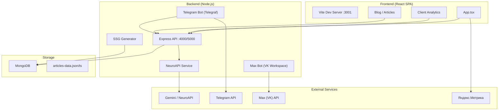
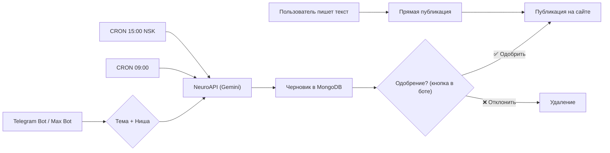

# 📋 Документация проекта PROBOOST (`sait-main`)

## Обзор

**PROBOOST** — это маркетинговое агентство, специализирующееся на продвижении доставок еды и ресторанов и не только. Проект `sait-main` представляет собой **полностековую платформу**, состоящую из:

- 🖥 **Лендинг-сайт** (React SPA) с блогом
- 🤖 **Telegram-бот** для управления контентом и аналитикой (переходим на макс)
- 🤖 **Max-бот** (VK Workspace) для генерации SEO-статей и управления контентом и аналитикой
- 📊 **API-сервер** с аналитикой и управлением статьями
- 🧠 **AI-генерация контента** через NeuroAPI / Gemini

> [!IMPORTANT]
> Домен проекта: **[pro-boost.ru](https://pro-boost.ru)**
> Владелец: ИП Калякин Д.А. (ОГРНИП: 325547600069350, ИНН: 540307997300)

---

## Архитектура



---

## Стек технологий

### Frontend
| Технология | Версия | Назначение |
|---|---|---|
| React | 19.2.3 | UI-фреймворк |
| Vite | 6.2.0 | Сборщик / Dev-сервер |
| TypeScript | 5.8.2 | Типизация |
| TailwindCSS | 4.2.1 | Утилитарные стили |
| Framer Motion | 12.23.26 | Анимации |
| Google GenAI SDK | 1.34.0 | Интеграция с Gemini (клиентская) |
| Inter (Google Fonts) | — | Шрифт |

### Backend
| Технология | Версия | Назначение |
|---|---|---|
| Express | 4.18.2 | HTTP-сервер и API |
| MongoDB | 6.3.0 | База данных |
| Telegraf | 4.14.0 | Telegram-бот |
| @maxhub/max-bot-api | — | Max (VK Workspace) бот |
| OpenAI SDK | 4.28.0 | Обёртка для NeuroAPI (Gemini) |
| node-cron | 3.0.2 | Планировщик задач |
| node-fetch | 3.3.0 | HTTP-клиент |

### Инфраструктура
| Компонент | Технология |
|---|---|
| Хостинг | Timeweb Cloud (Ubuntu 24.04) |
| Процессы | PM2 |
| Reverse Proxy | Nginx |
| SSL | Certbot (Let's Encrypt) |
| CI/CD | GitHub → `deploy.sh` |
| Аналитика | Яндекс.Метрика + Custom Analytics |

---

## Файловая структура

```
sait-main/
├── 📄 index.html            # HTML entry point (SEO, OG-метатеги, JSON-LD, Яндекс.Метрика)
├── 📄 index.tsx              # React entry point
├── 📄 index.css              # Глобальные стили (grain, glassmorphism, prose-article)
├── 📄 App.tsx                # Главный компонент (847 строк, всё в одном файле)
├── 📄 constants.tsx          # NAV_LINKS, SERVICES, REVIEWS
├── 📄 types.ts               # TypeScript интерфейсы (Service, Article, ReviewStory)
├── 📄 articles-data.ts       # Статические статьи блога (5 штук)
├── 📄 articles-data.json     # JSON-версия статей
├── 📄 vite.config.ts         # Конфигурация Vite (порт 3001, Tailwind, env)
├── 📄 package.json           # Frontend зависимости
├── 📄 tsconfig.json          # TypeScript конфиг
├── 📄 .env                   # Переменные окружения (API ключи)
├── 📄 .env.local             # Локальные переменные (GEMINI_API_KEY)
├── 📄 Procfile               # Heroku/Render деплой
├── 📄 deploy.sh              # Скрипт автодеплоя на Timeweb Cloud
├── 📄 DEPLOY_GUIDE.md        # Руководство по деплою
├── 📄 telegram-bot.js        # Упрощённый Telegram-бот (root-уровень)
├── 📹 отзыв Марина.mp4       # Видео-отзыв клиента
│
├── 📁 backend/               # Бэкенд (отдельный Node.js проект)
│   ├── 📄 server.js          # Express API + Max Bot + Cron
│   ├── 📄 telegram-bot.js    # Полнофункциональный Telegram-бот (Telegraf)
│   ├── 📄 ssg-generator.js   # SSG: HTML-страницы, Sitemap, RSS, Дзен
│   ├── 📄 package.json       # Backend зависимости
│   ├── 📄 .env               # Backend переменные
│   ├── 📄 .env.example       # Шаблон переменных
│   ├── 📄 pending-articles.json
│   ├── 📁 routes/
│   │   ├── 📄 drafts.js      # CRUD API для черновиков
│   │   └── 📄 webhook.js     # Webhook для Max (VK Workspace)
│   └── 📁 services/
│       ├── 📄 neuroapi.js     # AI генерация статей (Gemini через OpenAI SDK)
│       ├── 📄 max-api.js      # Интеграция с Max (VK Workspace)
│       └── 📄 command-parser.js # Парсер команд из Max
│
├── 📁 public/                # Статические файлы
│   ├── 📄 articles.json      # Публичные статьи
│   └── 📄 zen_*.html         # Верификация Яндекс.Дзен
│
└── 📁 siteproboost/          # Документация проекта (Obsidian vault)
    ├── 📄 ARCHITECTURE.md
    ├── 📄 DEPLOY_GUIDE.md
    ├── 📄 01–06 .md файлы    # Заметки по архитектуре, схемам БД, промптам
    └── 📁 .obsidian/         # Настройки Obsidian
```

---

## Frontend — Подробное описание

### Секции лендинга (`App.tsx`)

| # | Компонент | Описание |
|---|---|---|
| 1 | `LoadingScreen` | Анимированный экран загрузки с прогресс-баром и рандомными фразами |
| 2 | `CustomCursor` | Кастомный круглый курсор (только desktop) |
| 3 | `Navbar` | Фиксированная навигация с ссылками и CTA «Начать рост» |
| 4 | `Hero` | Главный экран: заголовок «МАРКЕТИНГ», фото, статистика (6 лет, 30+ кейсов) |
| 5 | `SmartFunnel` | Интерактивная воронка на scroll (800vh, 5 шагов: Охват → Лояльность) |
| 6 | `ServicesSection` | Сетка из 6 услуг (ВКонтакте, Яндекс Директ, Таргет, Геомаркетинг, База, Vibe-кодинг) |
| 7 | `StoriesSection` | Карусель отзывов клиентов в стиле Stories |
| 8 | `ContactSection` | Форма обратной связи (имя + Telegram/телефон) |
| 9 | `LeadModal` | Модальное окно «Обсудить проект» |
| 10 | `BlogPage` | Список статей с фильтрацией по категориям |
| 11 | `ArticlePage` | Страница отдельной статьи |
| 12 | `Footer` | Логотип, юридические данные ИП, ссылка на блог |

### Роутинг

Используется **hash-роутинг** (без react-router):
- `#/` или пусто → Лендинг
- `#/blog` → Список статей
- `#/blog/:slug` → Отдельная статья
  (нужно изменить и сделать без хештега, так как яндексу сказал гемини это не нравится)

### SEO

- Динамические Open Graph и Twitter Card метатеги (функция `updateMetaTags`)
- JSON-LD Schema.org (LocalBusiness)
- Canonical URL
- Яндекс.Метрика (webvisor, clickmap, trackLinks)
- Верификация Яндекс.Дзен (`public/zen_*.html`)

### Аналитика (Client-side)

Встроенная custom-аналитика, отправляющая события на `ANALYTICS_URL`:
- `page_view` — просмотр страницы
- `scroll` — глубина прокрутки (каждые 10%)
- `article_click` — клик по статье
- `cta_click` — клик по CTA-кнопке
- `page_unload` — время на странице

Каждый пользователь идентифицируется через `localStorage` (`analyticsUserId`).

### Дизайн-система

| Класс | Описание |
|---|---|
| `.grain` | Зернистая текстура поверх всего (SVG noise animation) |
| `.gradient-text` | Градиент белый → indigo на тексте |
| `.glass-card` | Glassmorphism-карточки (blur + полупрозрачность) |
| `.holographic-bg` | Голографический градиент фона |
| `.blue-glow` | Свечение кнопок |
| `.prose-article` | Типографика для статей (h2, h3, p, ul, a) |

---

## Backend — Подробное описание

### Express API (`server.js`, порт 4000/5000)

| Метод | Endpoint | Описание |
|---|---|---|
| GET | `/api/articles` | Все опубликованные статьи (status: published) |
| GET | `/api/articles/:id` | Конкретная статья |
| GET | `/api/drafts` | Все черновики |
| GET | `/health` | Healthcheck |

### Drafts API (`routes/drafts.js`)

| Метод | Endpoint | Описание |
|---|---|---|
| GET | `/api/drafts` | Список черновиков (pending/draft) |
| GET | `/api/drafts/:id` | Конкретный черновик |
| POST | `/api/drafts/:id/approve` | Одобрить → опубликовать |
| POST | `/api/drafts/:id/reject` | Отклонить → удалить |
| POST | `/api/drafts/:id/update` | Обновить контент |

### Webhook (`routes/webhook.js`)

| Метод | Endpoint | Описание |
|---|---|---|
| POST | `/webhook/max` | Приём сообщений из Max (VK Workspace) |

---

## AI-генерация контента

### Сервис: `services/neuroapi.js`

Использует **OpenAI SDK** с кастомным `baseURL` (NeuroAPI → Gemini):

- **Модель**: `gemini-2.0-flash`
- **Temperature**: 0.7
- **Max tokens**: 3000

#### Системный промпт (SEO-оптимизация)

Промпт задаёт следующие правила:
1. ❌ Запрет ИИ-жаргона («в современном мире», «безусловно» и т.д.)
2. ✅ GEO-оптимизация — прямой ответ сразу после каждого H2/H3
3. ✅ Минимум 2 списка в тексте
4. ✅ Реалистичная конкретика (цены, проценты, бюджеты)
5. ❌ Запрет на «введение» и «заключение»
6. ✅ Нативный CTA в конце

#### Доступные функции

```javascript
generateArticle(niche, topic)    // Генерация новой статьи
rewriteArticle(originalContent)  // Переписывание статьи
```

---

## Telegram-бот (`backend/telegram-bot.js`)

Полнофункциональный бот на **Telegraf** с клавиатурным меню.

### Команды и меню

```
📊 Аналитика → 📌 Статистика / 📊 Подробный анализ
✍️ Статьи   → 📝 Загрузить готовую / 🤖 По теме / 📋 Черновики
📈 Отчет 24ч
📈 Отчет 7 дней
ℹ️ Помощь
```

### Возможности

| Функция | Описание |
|---|---|
| Загрузка статьи | Пользователь отправляет текст → сразу публикация |
| Генерация по теме | Пользователь пишет тему → Gemini генерирует → черновик |
| Черновики | Просмотр / одобрение / отклонение pending-статей |
| Аналитика | Статистика по просмотрам, кликам, прокруткам |
| Подробный анализ | AI-анализ трафика через OpenAI |

### Cron-задачи

| Время | Действие |
|---|---|
| **09:00** | Автогенерация статьи → отправка на одобрение в Telegram |
| **18:00** | Вечерний отчёт аналитики в Telegram |

---

## Max Bot (`server.js` — VK Workspace)

Бот для корпоративного мессенджера **Max** (VK Workspace).

### Команды

```
/start → Главное меню
🚀 Генерировать → Ввести нишу → Ввести тему → Статья
📋 Черновики → Одобрить / Отклонить
✅ Опубликовать на сайт
⏱ Расписание (настраиваемое)
```

### Cron-задачи

| Время (UTC) | Время (NSK) | Действие |
|---|---|---|
| **08:00** | **15:00** | Генерация 3 статей (случайные ниши/темы) → черновики |

---

## SSG Generator (`ssg-generator.js`)

Генерирует статические файлы для SEO:

| Функция | Выход | Назначение |
|---|---|---|
| `generateArticleHTML()` | HTML-страницы | Индексация краулерами (redirect на SPA через 2 сек) |
| `generateSitemap()` | `sitemap.xml` | Карта сайта для поисковиков |
| `generateRSS()` | RSS-фид | Подписки и агрегаторы |
| `exportToYandexDzen()` | JSON | Экспорт в Яндекс.Дзен |

---

## База данных (MongoDB)

### Коллекция: `articles`

```javascript
{
  _id: "article-1775299280361",
  slug: "kejs-avito-390000",
  title: "Кейс: Как системный подход на Avito...",
  niche: "SEO",
  topic: "Avito продвижение",
  content: "<h2>...</h2><p>...</p>",     // HTML-контент
  excerpt: "Краткое описание статьи...",
  category: "strategy",
  tags: ["avito", "кейс", "маркетинг"],
  imageUrl: "https://images.unsplash.com/...",
  readTime: 7,
  source: "user_command" | "auto_cron" | "user",
  status: "draft" | "published",
  createdAt: ISODate,
  publishedAt: ISODate | null
}
```

### Коллекция: `drafts`

```javascript
{
  _id: "draft-1712345678",
  title: "...",
  niche: "...",
  topic: "...",
  content: "...",
  source: "user" | "auto",
  status: "pending_approval" | "draft" | "published",
  userId: "max-user-id",
  conversationId: "max-conversation-id",
  createdAt: ISODate,
  approvedAt: ISODate | null,
  publishedAt: ISODate | null
}
```

---

## Переменные окружения

### Frontend (`.env`)

| Переменная | Описание |
|---|---|
| `GEMINI_API_KEY` | Ключ Google Gemini API |
| `VITE_ANALYTICS_URL` | URL аналитического API |

### Backend (`backend/.env`)

| Переменная | Описание |
|---|---|
| `PORT` | Порт Express-сервера (4000/5000) |
| `TG_TOKEN` | Токен Telegram-бота (@BotFather) |
| `TG_CHAT_ID` | Chat ID для отчётов |
| `OPENAI_API_KEY` | Ключ NeuroAPI |
| `OPENAI_BASE_URL` | `https://neuroapi.host/v1` |
| `OPENAI_MODEL` | `gpt-5.4-mini` |
| `GEMINI_API_KEY` | Ключ Google Gemini |
| `MONGO_URL` | Строка подключения MongoDB |
| `MAX_BOT_TOKEN` | Токен Max-бота (VK Workspace) |
| `MAX_BOT_ID` | ID Max-бота |
| `MAX_WEBHOOK_SECRET` | Секрет для валидации webhook |
| `ANALYTICS_URL` | URL аналитического сервера |
| `NODE_ENV` | `production` / `development` |

> [!CAUTION]
> Файл `.env` содержит реальные API-ключи и токены ботов. **НЕ коммитить в публичный репозиторий!**

---

## Деплой

### Целевая платформа: Timeweb Cloud

- **ОС**: Ubuntu 24.04 LTS
- **CPU**: 1x 3.3 ГГц
- **RAM**: 2 ГБ
- **Диск**: 30 ГБ NVMe
- **Цена**: ~730₽/мес

### Скрипт деплоя (`deploy.sh`)

Полностью автоматический скрипт, который устанавливает:
1. Node.js 20 LTS + npm
2. MongoDB 7.0
3. PM2 (менеджер процессов)
4. Nginx (reverse proxy)
5. Certbot (SSL)
6. Клонирует репозиторий
7. Собирает фронтенд (`npm run build`)
8. Устанавливает зависимости бэкенда
9. Настраивает Nginx конфиг
10. Запускает приложения через PM2

### Nginx маршрутизация

```
/api/*         → localhost:5000 (Express API)
/sitemap.xml   → localhost:5000
/feed.xml      → localhost:5000
/health        → localhost:5000
/*             → /dist/index.html (React SPA)
```

### PM2 процессы

```
proboost-api  → node server.js      (Express + Max Bot)
proboost-bot  → node telegram-bot.js (Telegram Bot)
```

### Команды управления

```bash
pm2 status              # Статус
pm2 logs                # Все логи
pm2 restart all         # Перезапуск
pm2 logs proboost-bot   # Логи бота
```

---

## Статьи в блоге (встроенные)

| # | Slug | Тема | Категория |
|---|---|---|---|
| 1 | `kejs-avito-390000` | Кейс Avito: 390 000₽ на подсветке домов | strategy |
| 2 | `targetirovannaya-reklama-vkontakte-dlya-dostavki-edy` | Таргет ВК для доставки | ВКонтакте |
| 3 | `yandex-direct-dlya-restoranov-i-dostavki` | Яндекс Директ для ресторанов | Яндекс Директ |
| 4 | `prodvizhenie-v-telegram-dlya-restoranov` | Telegram для ресторанов (0→5000 подписчиков) | Telegram |
| 5 | `analiz-konkurentov-v-niche-dostavki-edy` | Анализ конкурентов в доставке | Стратегия |
| 6 | `geomarketing-2gis-yandex-karty-dlya-dostavki` | Геомаркетинг 2ГИС + Яндекс Карты | Геомаркетинг |

---

## Диаграмма потока контента



---

## Известные особенности

> [!WARNING]
> - **Монолитный `App.tsx`** — весь UI (847 строк) в одном файле, без разделения на компоненты
> - **Два Telegram-бота** — упрощённый (`/telegram-bot.js`) и полный (`backend/telegram-bot.js`)
> - **Два `.env` файла** — корневой и в `backend/`
> - **Хардкод API-ключей** в корневом `.env` (утечка в Git)
> - **Дублирование статей** — и в `articles-data.ts`, и в MongoDB, и в `public/articles.json`
> - **Webhook-валидация Max** — заглушка (`TODO: Реализовать проверку подписи`)
> - **SSG-генератор** — подготовлен, но не интегрирован в pipeline сборки

---

## Запуск локально

```bash
# Frontend
cd d:\MyPythonProjects\sait-main
npm install
npm run dev                # → http://localhost:3001

# Backend
cd backend
npm install
node server.js             # → Express + Max Bot на порту 4000
node telegram-bot.js       # → Telegram Bot
```

> [!NOTE]
> Для работы бэкенда требуется запущенный MongoDB на `localhost:27017`
